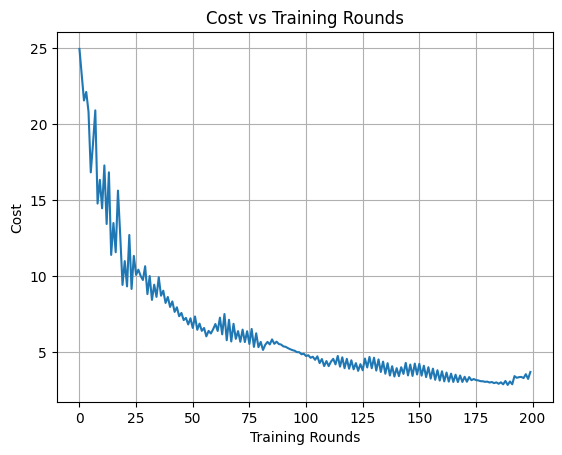
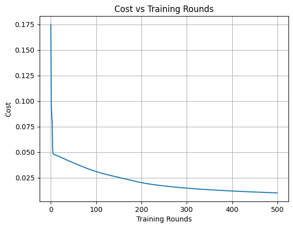

# 🧠 MNIST Neural Network Projects – CPU & GPU Variants

This repository contains two beginner-friendly neural network implementations from scratch (no frameworks like TensorFlow or PyTorch), designed for classifying MNIST handwritten digits. The code is written entirely in **object-oriented Python (OOP)** and demonstrates how neural networks work under the hood.

---

## 🧠 About This Project

> This project began as a CPU-only neural network using **Sigmoid** activation and **Mean Squared Error (MSE)** loss on small batches.  
>  
> After learning key neural network concepts like **ReLU**, **Softmax**, **cross-entropy loss**, **He initialization**, and **gradient clipping**, I extended the code into a full GPU-compatible version that works with the entire MNIST dataset.  
>  
> 🧱 **Project Structure Note:**  
> The notebooks are intentionally structured with clear, beginner-friendly comments and modular OOP code.  
> - Supports both **GPU and CPU execution**  
> - Allows **small-batch testing** for limited systems  
> - Enables **full-batch training** on GPU  
> - Includes toggles for **image display** and **gradient logging**  
>  
> ✅ You can uncomment or comment specific blocks depending on your system, goals, or learning pace.

---

## 📁 Project Files

### 1. `Model_Full_Run_GPU_only.ipynb`

- **Optimized for:** Full MNIST dataset with GPU acceleration (e.g., Google Colab GPU)
- **Features:**
  - Uses **ReLU** activation for hidden layers and **Softmax** for output
  - Uses **cross-entropy loss**
  - Implements **He initialization**
  - Includes **gradient clipping** to avoid exploding gradients
  - Final model test accuracy is printed
  - Cost per epoch is tracked and plotted

---

### 2. `Model-SmallBatch-CPU.ipynb`

- **Optimized for:** Small batches (user-defined) on CPU (low-resource machines)
- **Features:**
  - Uses **Sigmoid** activation in all layers
  - Uses **mean squared error (MSE)** as the loss function
  - Best suited for learning, debugging, or environments without GPU
  - Accepts dynamic input for training and testing batch sizes

---

## 🔧 Setup Instructions

### ✅ First-Time Setup (For both notebooks)

Uncomment and run this line in a notebook cell:

```python
# %pip install pandas numpy matplotlib pillow
```

---

## 📂 Dataset Source

This project uses the **MNIST Handwritten Digits Dataset** in CSV format.

You can download it from Kaggle:

> 🔗 [Kaggle Dataset – MNIST in CSV](https://www.kaggle.com/datasets/oddrationale/mnist-in-csv)  
> 📌 **Credit:** This dataset was created and shared by [oddrationale](https://www.kaggle.com/oddrationale) on Kaggle.

After downloading:

1. Extract the zip file.
2. Place the following files in the **same directory as the notebooks**:
   - `mnist_train.csv`
   - `mnist_test.csv`

These files are required to run both notebook versions.

---

## 🚀 Usage Guide

### 🔹 1. `Model_Full_Run_GPU_only.ipynb` — Full Dataset (GPU Only)

- **Architecture:**
  - Input Layer: 784 neurons  
  - Hidden Layer 1: 107 neurons (ReLU)  
  - Hidden Layer 2: 26 neurons (ReLU)  
  - Output Layer: 10 neurons (Softmax)

- **Training Details:**
  - Cross-entropy loss
  - Gradient clipping (clip value = 1.0)
  - Cost vs Epoch graph
  - Final test accuracy displayed

**📈 Example Output:**
```
Training Round 200/200 - Cost: 2.748052
Tested on 10000 images.
Accuracy: 91.67% (9167/10000)
```

---

### 🔹 2. `Model-SmallBatch-CPU.ipynb` — Small Batches (CPU Friendly)

- **Architecture:**
  - Input Layer: 784 neurons  
  - Hidden Layer 1: 107 neurons (Sigmoid)  
  - Hidden Layer 2: 26 neurons (Sigmoid)  
  - Output Layer: 10 neurons (Sigmoid)

- **Usage:**
  - Prompts user for:
    - Training batch size
    - Testing batch size
  - Trains and tests only on those samples

- **Loss Function:**
  - Mean Squared Error (MSE)

**🧪 Example Output:**
```
Training with 400 samples...
Round 400, Cost: 0.0283
Testing with 50 samples...
Model accuracy on this batch: 86.00%
```

---

## 📊 Visualization

- Both notebooks generate a **Cost vs Training Rounds** graph.
- You can also enable:
  - **Image display**
  - **Delta, dJ/dW, dJ/dB outputs** (for debugging small batches)

---

## 🖼️ Example Cost Graphs

### GPU Version
Cost vs Epoch graph from `Model_Full_Run_GPU_only.ipynb`:



---

### CPU Version
Cost vs Training Rounds graph from `Model-SmallBatch-CPU.ipynb`:




## 🧑‍💻 Author

**Ayush Agarwal**  
> My first neural network project built entirely from scratch using NumPy and core Python.

---

## 📜 License

This project is open-source and free to use for educational and experimentation purposes.
